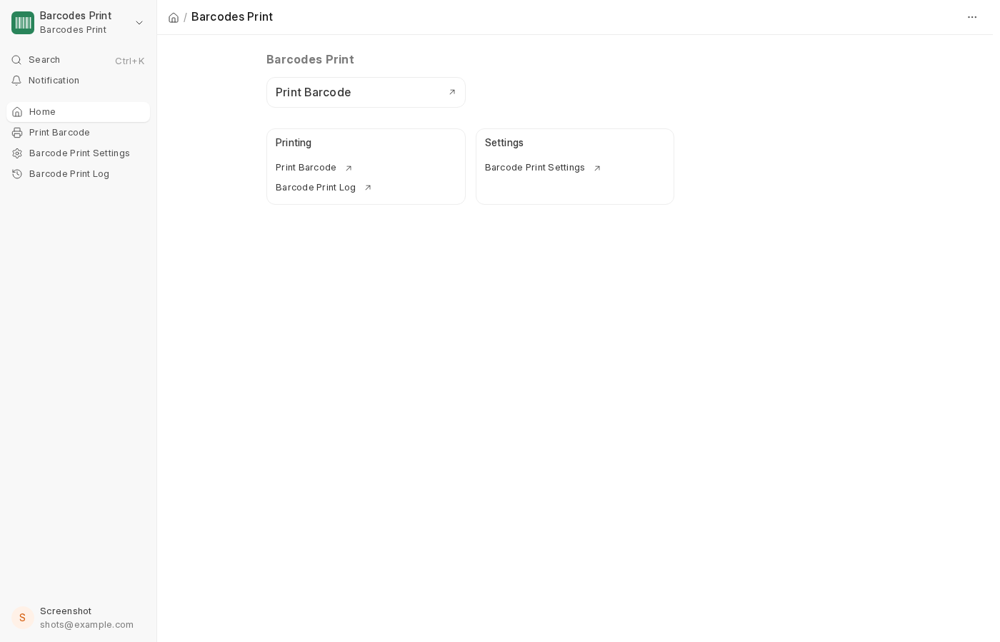
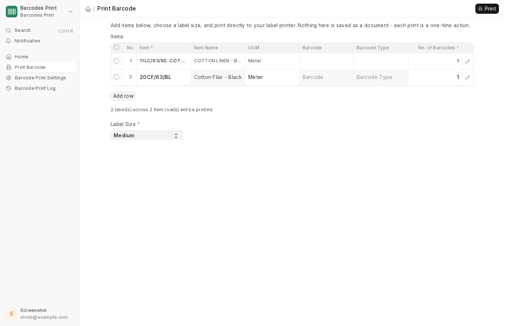
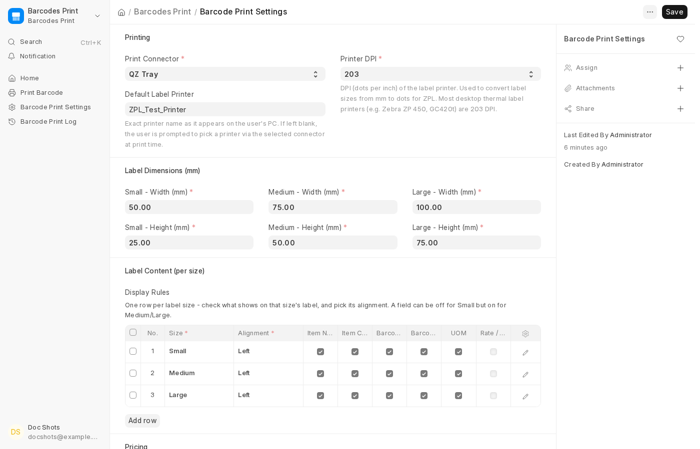
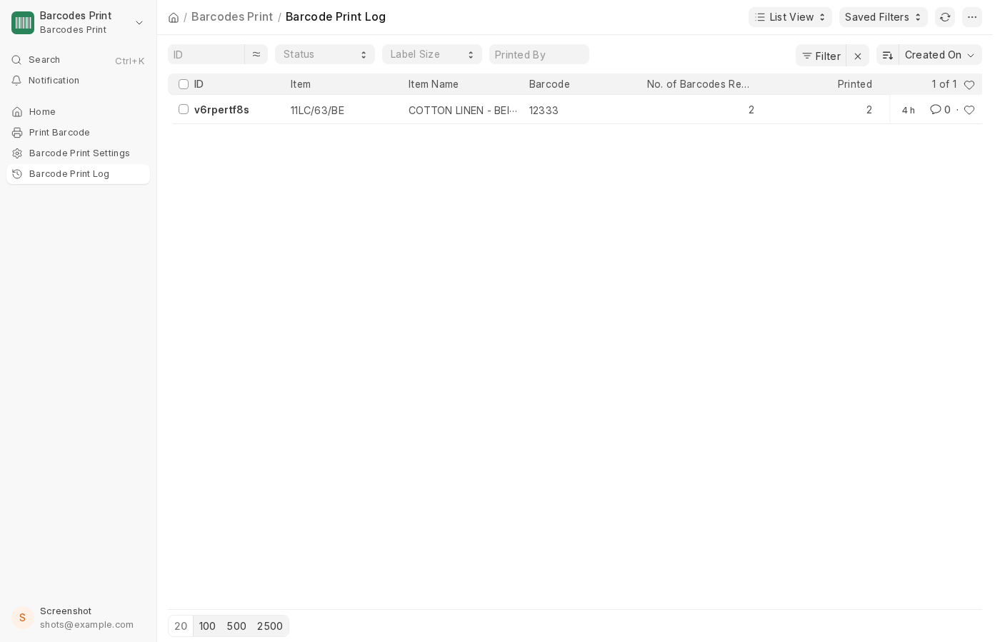

# Barcodes Print

Direct-to-printer **barcode label printing** for ERPNext, via QZ Tray or Zebra Browser Print.

You add items (or open it straight from a submitted Purchase Order/Purchase Receipt), pick a label size, and click Print — the label goes straight to a local thermal printer as raw ZPL. No print preview, no browser print dialog, no PDF step.

## Why this matters

Standard ERPNext barcode printing means generating a print format, opening a browser print-preview screen, and sending it through the OS print dialog — slow for a warehouse doing this dozens of times a day, and it renders barcodes as an image rather than native printer commands, which prints noticeably softer/slower on thermal printers than the printer's own barcode engine. There's also no size-aware protection against printing an unscannable code (a QR code squeezed onto a tiny label with too many other fields on it will fail to scan in practice, not just in theory), and no record of who printed what, when, or how many — reprints for damaged labels happen with no trace and no limit.

This app replaces all of that with a one-time-use print action: raw ZPL sent directly to the printer via a local desktop agent (QZ Tray, or Zebra Browser Print on Windows/macOS), label content and barcode bar width that scale to the label size you actually pick, a hard block on print combinations that would be too small to scan reliably, and an audit log of every print attempt — including failures and why.

Two things worth knowing before relying on this:

- **Not yet tested against a real physical printer.** Development and testing used QZ Tray's real desktop app talking to a CUPS virtual "print-to-file" queue, with each captured job rendered through [Labelary](http://labelary.com/viewer.html) to confirm it's correct — a real, working pipeline end to end, just never with actual ink on a physical label roll.
- **The Zebra Browser Print connector is unverified on real hardware.** Zebra's Browser Print client has no public Linux build (Windows/macOS only, gated behind contacting a Zebra sales engineer for Linux), so it was built against its publicly documented JS API but has not been exercised against a live device. QZ Tray is the connector that's actually been proven working.

## What it does

Barcodes Print ships its own sidebar workspace and app icon, so it shows up on the Desk home screen and left sidebar like any other module:



**Print Barcode page.** The only way to print — add item rows (auto-fetching Item Name/UOM/Barcode/Barcode Type as you go), pick Small/Medium/Large, and print. Nothing here is ever saved as a document; a live running total keeps you honest about how many labels are about to go to the printer before you commit.

If an Item has more than one barcode registered, you're asked which one to use rather than the system silently guessing the first one in the list.



**Purchase Order / Purchase Receipt integration (optional, off by default).** Turn it on in Settings and pick exactly one of the two document types — a **Print Barcode** button then appears on submitted documents of that type, pre-filling the page with that document's items. Each line's starting quantity defaults to whatever's still allowed (line quantity + a configurable number of extras, minus what's already been printed for that line), and a per-line **Barcodes Printed** counter tracks the running total. The limit is re-checked against the database on every print — a user can't bypass it by editing the request.

**Barcode Print Settings.** One screen controls everything:
- **Print Connector** — QZ Tray or Zebra Browser Print, one at a time, plus the default printer name and printer DPI.
- **Label Dimensions (mm)** — width/height for Small, Medium, and Large.
- **Display Rules** — a table with one row per label size: independent show/hide checkboxes (Item Name, Item Code, Barcode Number, Barcode Type, UOM, Rate) and a Left/Center/Right alignment, per size. A field can be off for Small but on for Medium/Large.
- **Purchase Document Printing** — the enable flag, which document type, and the extra-barcodes allowance described above.



**Barcode Print Log.** A read-mostly audit trail written automatically after every print attempt — item, barcode, quantity requested vs. actually printed vs. failed, a status of Success/Failed with the failure reason on record, and which Purchase Order/Receipt line (if any) it came from. QZ Tray and Zebra Browser Print each send one combined job per print action, so success/failure is tracked per print action, not per individual label within it.



## Doctypes

| Doctype | Type | Purpose |
|---|---|---|
| Barcode Print Settings | Single | Central configuration — the only doctype with one record per site. |
| Barcode Label Display Rule | Child table | One row per label size (Small/Medium/Large): display toggles + alignment. |
| Print Label Item | Child table | Row schema for the Print Barcode page's item grid — not a persisted business record. |
| Barcode Print Log | Standalone | Audit trail of every print attempt, success or failure. |

## Pages

| Page | Purpose |
|---|---|
| Print Barcode | The only printing UI — one-time-use, nothing saved as a document. |

## Barcode types supported

EAN-13, EAN-8, UPC-A, UPC-E, Code 39, Code 128, ITF / ITF-14 / GTIN-14, Codabar, QR Code, and Data Matrix each get their own native ZPL barcode command (not an image render). ISBN/ISSN/JAN/PZN and anything else without a dedicated ZPL symbology fall back to Code 128, which safely encodes any text/alphanumeric value.

If an Item's barcode has no type recorded, the type is auto-detected from the value itself, in this priority order: **EAN-13 → EAN-8 → UPC → Code 39 → Code 128**. QR Code and Data Matrix are only ever used when explicitly set on the Item — never auto-detected — and printing one is blocked outright (not just discouraged) if the chosen label size and display toggles would render it under 10mm, the accepted floor for reliable scanning.

## QZ Tray setup (end users, one time)

Each PC that will actually print needs QZ Tray running locally:

1. Download QZ Tray from [qz.io/download](https://qz.io/download/) and install it.
2. Launch it — confirm it's running in the system tray (Windows) or menu bar (macOS/Linux).
3. Connect the label printer to that PC and note its exact name as it appears in the OS's printer list.
4. Set the printer's label roll size in its OS driver preferences.
5. In **Barcode Print Settings**, set the exact printer name under **Default Label Printer** (optional — if left blank, QZ Tray falls back to that PC's own default printer).
6. The first time a print happens from a given browser/site, QZ Tray shows a one-time "Action Required" popup — check **Remember this decision** and click **Allow**.

From then on, clicking Print on the Print Barcode page sends straight to that printer — no further prompts, no browser dialog.

## Compatibility

Built and tested against **Frappe v16.26 / ERPNext v16.26**. The app's own code has no version-specific ERPNext customizations, so it should install cleanly on v15 too, but that hasn't been separately verified.

## Install

```bash
bench get-app https://github.com/Rahul-ai1/ERPNext-Barcodes-Print.git
bench --site <your-site> install-app barcodes_print
bench --site <your-site> migrate
bench restart
```

## License

MIT
